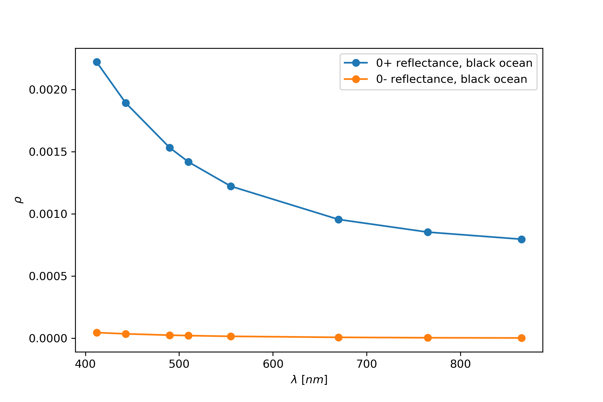
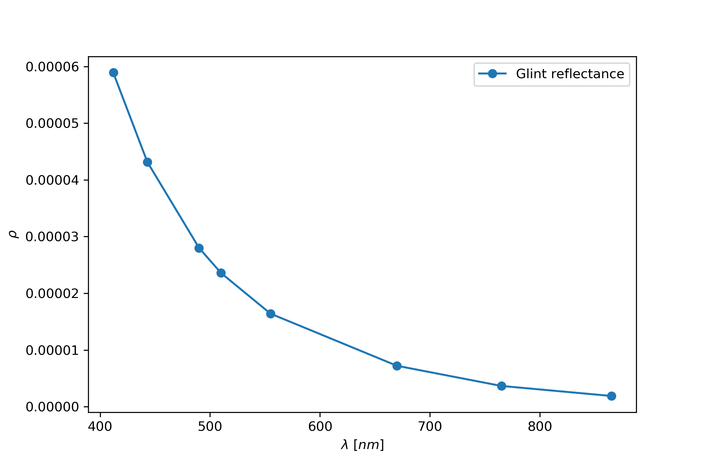
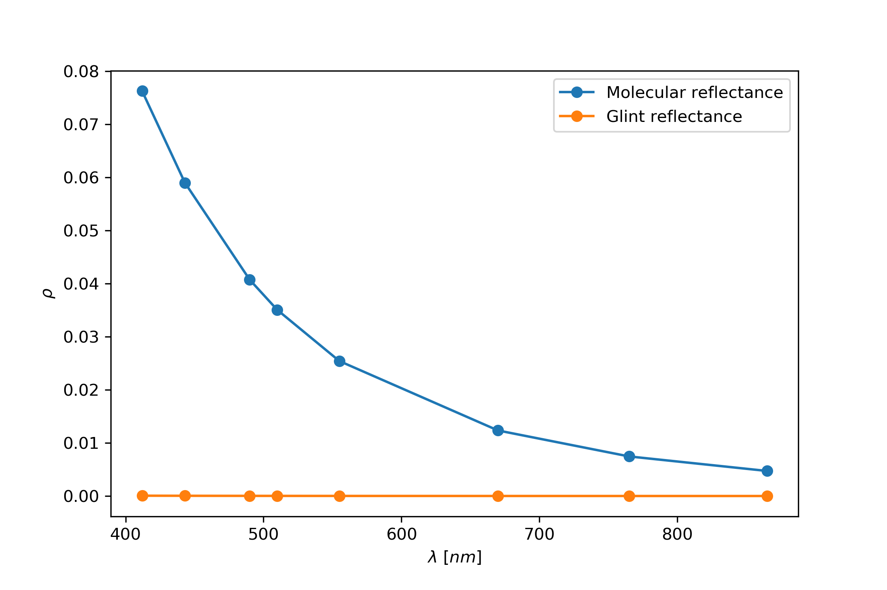
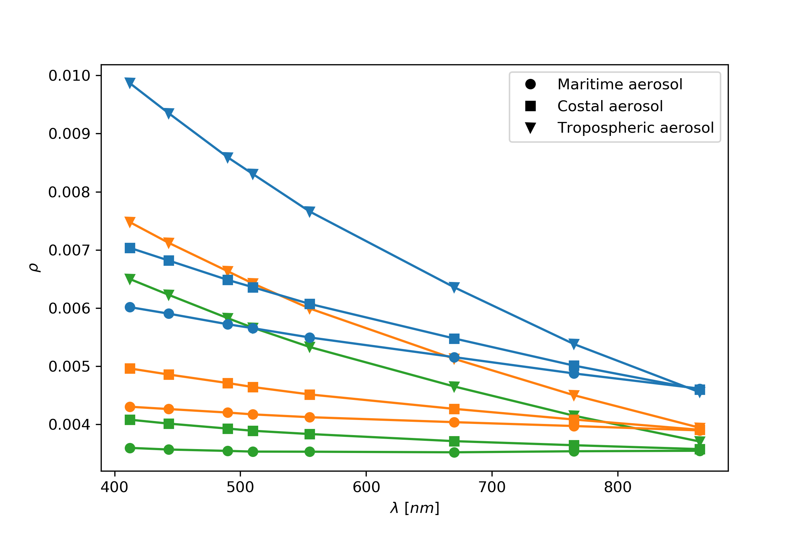
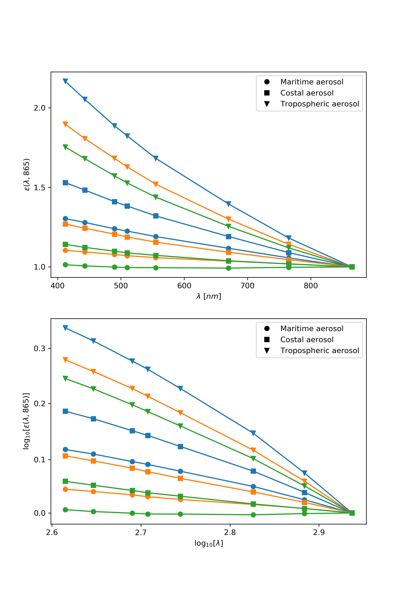
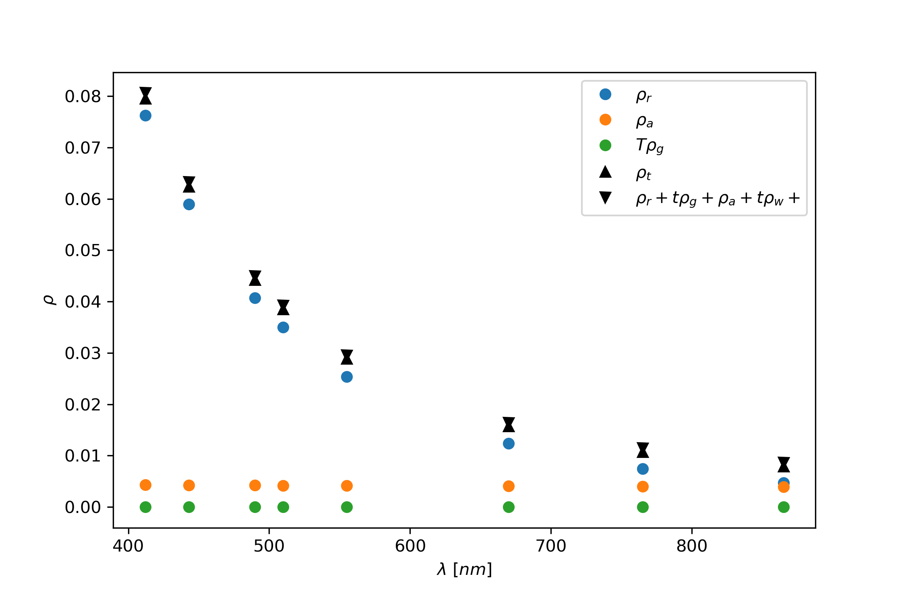

.. toctree::
  :maxdepth: 2
  :caption: Contents:

Case study: Intercomparison between the different atmospheric components
========================================================================

Introduction
------------

This notebook is inspired by the computations realized by H. R. Gordon and M.
Wang for the SeaWiFS satellite and it illustrates the use of the pyOSOAA python
library.

The objective here is to simulate the ocean-atmosphere system for a completely
absorbing ocean and from that be able to separate the glint, molecular and
aerosol reflectances.

Simple radiative transfer equation
----------------------------------

A simple radiative transfer model for the top of the atmosphere radiance is given by

.. math::

  \rho_t = \rho_r + \rho_a + \rho_{ra} + \rho_g + t\rho_w

where

.. math::

  \rho = \frac{\pi L}{F_0 \cos\theta_0}

and the subindices represent

t : Top of the atmosphere
r : molecular scattering
a : aerosol scattering
ra : aerosol-molecular coupled scattering
g : glint
w : water
for a black ocean where :math:`\rho_t \sim 0` the component :math:`\rho_a + \rho_{ra}` can be solved from this equation.

We aim to do this in the present work for the SeaWiFS wavelengths. We will use the ``pyOSOAA`` code to perform these simulations and compute

::

  import numpy as np
  import pyOSOAA
  from pyOSOAA.osoaahelpers import RunWavelengths
  import matplotlib.pyplot as plt

Geometric configuration
-----------------------

We will start by defining the basic ``pyOSOAA`` object, along with the
wavelengths used in the script and the angles.

::

  s = pyOSOAA.OSOAA()
  view = 0
  wavelengths = np.array([412, 443, 490, 510, 555, 670, 765, 865])/1000
  s.view.phi = 90
  s.ang.thetas = 60

Black ocean
-----------

The first calculation is to define a set of parameters that let us compute a
black ocean. To do it we create a very shallow ocean with no bottom albedo and
no dissolved material of any kind. We also set the wind speed to 10m/s

::

  # Sea bottom configuration
  s.sea.depth = 0.05
  s.sea.bottype = 1
  s.sea.botalb = 0

  # Sea particles configuration
  s.phyto.chl = 0
  s.sed.csed = 0
  s.det.abs440 = 0
  s.ys.abs440 = 0

  # Sea surface configuration
  s.sea.wind = 10

We will compute the reflectance both above (view level 3) and below (view level 4) the sea surface.

::

  # Configure view level below the surface
  s.view.level = 3
  rhowg = RunWavelengths(s, wavelengths, view)/np.cos(np.pi*s.ang.thetas/180.0)

  # Configure view level below the surface
  s.view.level = 4
  rhowl = RunWavelengths(s, wavelengths, view)/np.cos(np.pi*s.ang.thetas/180.0)

We see that the reflectance below the sea surface, equal to the water leaving radiance, is negligible next to the reflectance just above the surface, that includes the glint component

::

  plt.figure(figsize=(7.5,5))
  plt.plot(wavelengths*1e3,rhowg,'o-',label="0+ reflectance, black ocean")
  plt.plot(wavelengths*1e3,rhowl,'o-',label="0- reflectance, black ocean")
  plt.xlabel(r"$\lambda$ [$nm$]"); plt.ylabel(r"$\rho$"); plt.legend()
  plt.savefig("black.png",dpi=300,transparent=True)
  plt.show()

We will continue using this ocean configuration during this case study.

Glint reflectance
-----------------
We want to now compute the glint reflectance, to do this we will compute the
water leaving radiance for a very low aerosol and molecular optical thickness just above the sea surface

::

  # Small optical thickness
  s.ap.SetMot(0.0005)
  s.aer.aotref = 0.00001

  # View level
  s.view.level = 4
  rhog = RunWavelengths(s, wavelengths, view)/np.cos(np.pi*s.ang.thetas/180.0)

  plt.figure(figsize=(7.5,5))
  plt.plot(wavelengths*1e3,rhog,'o-',label="Glint reflectance")
  plt.xlabel(r"$\lambda$ [$nm$]"); plt.ylabel(r"$\rho$"); plt.legend()
  plt.savefig("glint.png",dpi=300,transparent=True)
  plt.show()

As we can see the glint reflectance behaves as expected.

Molecular scattering
--------------------

We now compute the molecular scattering effect by setting the pressure to a
standard pressure and the level at the top of the atmosphere

::

  # Small optical thickness
  s.ap.SetPressure(1013.25)

  # Set view level at TOA
  s.view.level = 1
  rhor = RunWavelengths(s, wavelengths, view)/np.cos(np.pi*s.ang.thetas/180.0)

  plt.figure(figsize=(7.5,5))
  plt.plot(wavelengths*1e3,rhor,'o-',label="Molecular reflectance")
  plt.plot(wavelengths*1e3,rhog,'o-',label="Glint reflectance")
  plt.xlabel(r"$\lambda$ [$nm$]"); plt.ylabel(r"$\rho$")
  plt.legend()
  plt.savefig("mot.png",dpi=300,transparent=True)
  plt.show()

We again see that the glint reflectance, for the current geometric
configuration is negligible and we can ignore it for what followed.

Aerosol scattering
------------------

We now compute the aerosol scattering effect by setting the aerosol optical
thickness to a nonzero value and the molecular optical thickness to zero.

.. code-block:: python

  # We set the aerosol optical thickness
  s.aer.aotref = 0.1
  s.ap.SetMot(0.0005)

  # Set view level at TOA
  s.view.level = 1

  # Define aerosol models to compute
  AerosolModels = {"T70":(1,70), "T90":(1,90), "T98":(1,98),
                 "M70":(3,70), "M90":(3,90), "M98":(3,98),
                 "C70":(4,70), "C90":(4,90), "C98":(4,98)}

  color = {"T70":"v-C0", "T90":"v-C1", "T98":"v-C2",
         "M70":"o-C0", "M90":"o-C1", "M98":"o-C2",
         "C70":"s-C0", "C90":"s-C1", "C98":"s-C2"}

  # Run the different models
  results = {}

  for key in AerosolModels.keys():
    model = AerosolModels[key]
    s.aer.SetModel(model=2, sfmodel=model[0], rh=model[1])
    results[key] = RunWavelengths(s, wavelengths, view)/np.cos(np.pi*s.ang.thetas/180.0)

  plt.figure(figsize=(7.5,5))
  plt.plot([],[],'ok',label="Maritime aerosol")
  plt.plot([],[],'sk',label="Costal aerosol")
  plt.plot([],[],'vk',label="Tropospheric aerosol")

  for key in results.keys():
    plt.plot(wavelengths*1e3, results[key], color[key])
  plt.xlabel(r"$\lambda$ [$nm$]"); plt.ylabel(r"$\rho$"); plt.legend()
  plt.savefig("aero.png", dpi=300, transparent=True)
  plt.show()

We can also compute the :math:`\epsilon(\lambda,865)` values as defined by
Gordon-Wang.

.. code-block:: python

  plt.figure(figsize=(7.5,11))
  plt.subplot(2, 1, 1)
  for key in results.keys():
    plt.plot(wavelengths*1e3, results[key]/results[key][-1], color[key])

  plt.xticks([400,500,600,700,800]); plt.yticks([1.0,1.5,2.0])
  plt.xlabel(r"$\lambda$ [$nm$]"); plt.ylabel(r"$\epsilon(\lambda,865)$")
  plt.plot([],[],'ok',label="Maritime aerosol")
  plt.plot([],[],'sk',label="Costal aerosol")
  plt.plot([],[],'vk',label="Tropospheric aerosol")
  plt.legend()

  plt.subplot(2, 1, 2)
  for key in results.keys():
    plt.plot(wavelengths*1e3, results[key]/results[key][-1], color[key])

  plt.loglog(basex=10,basey=10,subsx=[0],subsy=[0])
  plt.xticks([398,501,631,794],[2.6,2.7,2.8,2.9])
  plt.yticks([1,1.25,1.58,1.99,2.51],[0.0,0.1,0.2,0.3,0.4])
  plt.xlabel(r"$\log_{10}[\lambda]$")
  plt.ylabel(r"$\log_{10}[\epsilon(\lambda,865)]$")
  plt.plot([],[],'ok',label="Maritime aerosol")
  plt.plot([],[],'sk',label="Costal aerosol")
  plt.plot([],[],'vk',label="Tropospheric aerosol")
  plt.legend()

  plt.savefig("epsilon.png", dpi=300, transparent=True)
  plt.show()

Total scattering
----------------

We can now compute the total scattering by adding each component and by
performing the simulation. We will do this for the maritime model with
90% relative humidity.

::

  # We set the aerosol and molecular optical thickness
  s.aer.aotref = 0.1
  s.ap.SetPressure(1013.25)

  key = "M90"
  # Set aerosol model
  model = AerosolModels[key]
  s.aer.SetModel(model=2, sfmodel=model[0], rh=model[1])

  # Set view level at TOA
  s.view.level = 1
  rhot = RunWavelengths(s, wavelengths, view)/np.cos(np.pi*s.ang.thetas/180.0)

We also compute the transmittances for the molecular and aerosol model.
We use :math:`\tau_a = 0.1` for all bands as the aerosol optical thickness.

::

  taur = np.array([0.317976, 0.235460, 0.15540,
                  0.131940, 0.093379, 0.04341,
                  0.025863, 0.015460])
  Tr = np.exp(-(taur+0.1)*(1/np.cos(np.pi*view/180.0)
                    +1/np.cos(np.pi*s.ang.thetas/180.0)))
  tr = np.exp(-taur/2*(1/np.cos(np.pi*view/180.0)
                    +1/np.cos(np.pi*s.ang.thetas/180.0)))
  In [20]:
  plt.figure(figsize=(7.5,5))
  plt.plot(wavelengths*1e3, rhor-Tr*rhog, 'o', label=r"$\rho_r$")
  plt.plot(wavelengths*1e3, results["M90"], 'o', label=r"$\rho_a$")
  plt.plot(wavelengths*1e3, Tr*rhog, 'o', label=r"$T\rho_g$")
  plt.plot(wavelengths*1e3, rhot, '^k', label=r"$\rho_t$")
  plt.plot(wavelengths*1e3, rhor+results[key]+rhowl*tr, 'vk',
          label=r"$\rho_r + t\rho_g + \rho_a + t\rho_w + $")

  plt.xlabel(r"$\lambda$ [$nm$]"); plt.ylabel(r"$\rho$")
  plt.legend()
  plt.savefig("combined.png", dpi=300, transparent=True)
  plt.show()

Were the small difference we have is of order 0.001 and comes from not taking
into account the molecular and aerosol scattering interaction.
